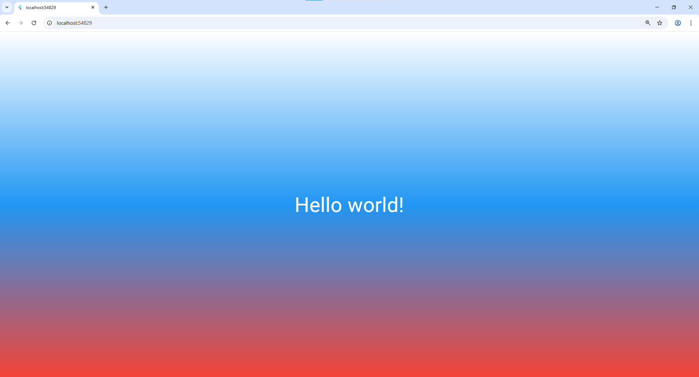

# Лабораторная работа №2. Знакомство с Flutter

## Выполнили
- **Плеско Данил** - ИСП-231
- **Текутова Вика** - ИСП-231

---

## Цель работы

Познакомиться с основным инструментом кроссплатформенной разработки — Flutter. Создать и запустить первый Flutter-проект в браузере Chrome, изучить структуру проекта и базовые концепции фреймворка — виджеты и дерево виджетов.

---

## Инструменты

| Инструмент | Версия |
|------------|--------|
| Flutter | 3.35+ |
| Dart | 3.11+ |
| VS Code | — |
| Git | — |
| Браузер | Google Chrome |

---

## Выполненные шаги

### Часть 1. Подготовка проекта

1. **Проверка инструментов** — выполнена команда `flutter --version` и `flutter devices`
2. **Создание проекта** — `flutter create first_flutter_app`
3. **Запуск проекта** — `flutter run -d chrome`

### Часть 2. Настройка Git и GitHub

1. Инициализирован репозиторий: `git init -b main`
2. Настроен `.gitignore` (исключены папки android/, ios/ и другие)
3. Создан первый коммит
4. Репозиторий подключён к GitHub и выполнен push

### Часть 3. Изучение инструментов VS Code

- Настроена длина строки: `"dart.lineLength": 50`
- Изучены способы запуска:
  - CodeLens (Run/Debug над `main()`)
  - Ctrl+F5 (Run Without Debugging)
  - F5 (Debug Mode)
  - Command Palette (Ctrl+Shift+P)
- Изучены Hot Reload (`r`) и Hot Restart (`R`)
- Открыт Flutter DevTools и Flutter Inspector

### Часть 4. Разбор работы setState()

Изучен механизм работы `setState()` на примере встроенного счётчика.

### Часть 5. Написание приложения с нуля

Написано приложение со следующим деревом виджетов:
```
MaterialApp
└── Scaffold
└── Container
└── Center
└── Text
```

**Что было сделано:**
- Создана точка входа `main()`
- Подключён `import 'package:flutter/material.dart'`
- Добавлен `MaterialApp` с параметром `home`
- Добавлен `Scaffold` для структуры экрана
- Отключён DEBUG-баннер (`debugShowCheckedModeBanner: false`)
- Добавлен фон через `backgroundColor` (сплошной цвет)
- Добавлен градиент через `Container` + `BoxDecoration` + `LinearGradient`
- Настроено направление градиента через `begin` и `end`
- Оформлен текст через `TextStyle` (размер 32, белый цвет)

## Скриншот приложения


## Как запустить проект
### Клонировать репозиторий
`git clone <URL_репозитория>`

### Перейти в папку проекта
`cd first_flutter_app`

### Установить зависимости
`flutter pub get`

### Запустить в Chrome
`flutter run -d chrome`